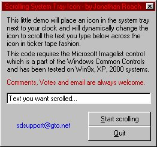



## Scrolling SysTray Icon

### Description

This code demonstrates how to place an icon into the system tray and then make text dynamically scroll across the icon in ticker tape fashion right in the system tray next to your clock.
 
### More Info
 
Tested on Win9x, XP, 2000 machines and developed in VB 5.

Also requires the Microsoft Common Controls, in specific, the ImageList Control.

             |
---                |---
**Submitted On**   |2001-12-11 16:33:42
**By**             |[Jonathan Roach](https://github.com/Planet-Source-Code/PSCIndex/blob/master/ByAuthor/jonathan-roach.md)
**Level**          |Intermediate
**User Rating**    |4.9 (89 globes from 18 users)
**Compatibility**  |VB 5\.0, VB 6\.0
**Category**       |[Miscellaneous](https://github.com/Planet-Source-Code/PSCIndex/blob/master/ByCategory/miscellaneous__1-1.md)
**World**          |[Visual Basic](https://github.com/Planet-Source-Code/PSCIndex/blob/master/ByWorld/visual-basic.md)
**Archive File**   |[Scrolling\_4123212112001\.zip](https://github.com/Planet-Source-Code/jonathan-roach-scrolling-systray-icon__1-29675/archive/master.zip)

### API Declarations

Shell_NotifyIcon

